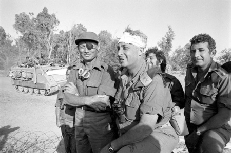
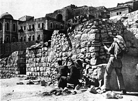
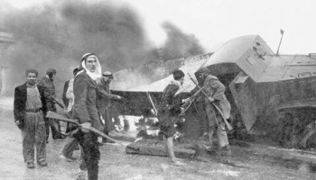

# ⚔️ The Battle of Al-Latrun

Al-Latrun was a battle between the Jordanian army and the Israeli forces that lasted from May 15 until May 23, 1948.

It was one of the battles of Jerusalem in the Arab-Israeli war (the 1948 war). This battle was followed by another battle, Bab al-Wad, through which Jerusalem was liberated. The battles of Latrun and Bab al-Wad are among the few successful battles. 1200 Jordanian soldiers were able to defend Jerusalem in return for 6,500 Israelis.

The losses of the Israeli forces were great in this battle, and among them was the American officer David Marcus, who stood by the Israelis, and was killed by an error which was caused by shooting from an Israeli soldier, and the Jordanian forces were led by Field Marshal Habis Al-Majali. The Israeli army was led by Ariel Sharon, who later became Prime Minister (2001-2006).

Ariel Sharon was wounded in the battle, and he was captured by the Jordanian Arab army. Capt. Habis Al-Majali - the Marshal later - captured him on that day, who treated him and transferred him to the back lines, then to Mafraq in Jordan, where the concentration camp for Jewish prisoners was set up.

After the second truce. In 1985, Israeli MP Uzi Landau said in the Knesset that the number of Israeli dead in Latrun exceeded 2,000, and after severe criticism, he lowered his estimate to 1,000. The leader of the volunteer fighters was from the Bedouin Sheikh Nahar bin Sab` al-Nuaimi (the brother of Dhiba).

After the death of former Israeli Prime Minister Ariel Sharon at the age of 85, after he fell into a deep coma from torment in the world eight years ago, after suffering a stroke.

We stop here at a bright station in the life of the late, God willing, Field Marshal Habis al-Majali. In the battle of Latrun in 1948, the commander of the Fourth Battalion, Captain “then” Habis al-Majali, was able to capture the terrorist, the former head of the Zionist gangs, Ariel Sharon, who himself wrote in his memoirs. He was captured by the Jordanian army during the 1948 war, along with his soldiers, and was captured on that day by Captain Habis Al-Majali, the "later Marshal", who treated him and transferred him to the back lines. Then he was taken to Mafraq in Jordan, where the camp for Israeli prisoners was set up, and he was replaced by an Arab prisoner when the exchange took place. prisoners after the second armistice.

Sharon, who joined the ranks of the Haganah organization or "gangs" in 1942 and was 14 years old at the time, and moved to work in the Israeli army, after the establishment of the State of Israel, wrote that when the peace agreement between Jordan and Israel was signed in Wadi Araba, he asked - i.e. Ariel Sharon - Meeting Habis, however, “Al-Basha” Al-Majali refused to meet him in mockery of him, and it was reported by Al-Basha Al-Majali said: I have captured many of them, so how can he ask me to remember him!

May God have mercy on Field Marshal Habis Al-Majali as wide as his love for his homeland, his people, his army, and his Hashemite leadership. and the difference is great between the death of heroes who die with their dignity while leaving Khawabi with loyalty, purity, masculinity, and tolerance, like Pasha Majali.. and the death of criminals, tyrants, like the terrorist Sharon stained his biography. With heinous crimes!

## About the Author

Mujahid Al-Majali, a 29-year-old former air force soldier and an economic development and business specialist, also does translation and copywriting. Loves long drives, chill music and old school movies. A nicotine addict and a huge fan of Jack Daniel’s whiskey. Owned multiple businesses in Amman and southern of Jordan PRE-COVID and now focusing on translation and copywriting part of my experience through Upwork.
