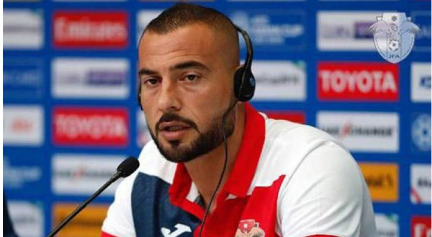
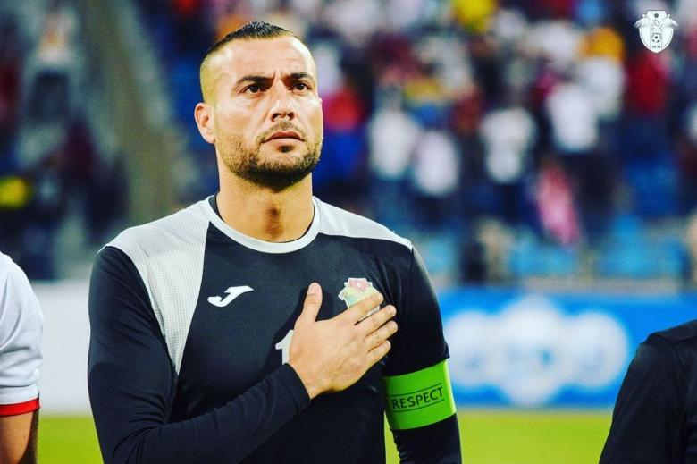

# 🥅 Amer Shafee, One of The Best Goalkeepers in History

Amer Shafee, who started with Yarmouk youth in 1994, emerged quickly through his joining the national teams, where he guarded the first national team goal since 2000, and before that he was like the junior team in 1995, the youth team in 1997, and the Olympic team in 2000. In the Asian finals that the team fought The National 2004 in China appeared as a patron at a decent level that made him the most prominent on the Asian continent, and it was he who pushed Al-Faisaly to sign him for the 2004-2005 season and then played with the Egyptian Ismaili 2005 before returning to Yarmouk in the 2005-2006 season and finally with Al-Wehdat in 2006.

Shafie has a proven track record through his remarkable presence in the events he went through with the national team. In addition to the 2004 Asian finals, he emerged in the finals that took place in Doha 2011 and won the title of the best player in more than one match the team played at the time. But now, Shafie is presenting great levels with Al-Wehdat and the Jordanian national team.

Shafie has played 168 international matches with the Jordanian national team, as he is considered the third most goalkeeper in the history of world football, after Saudi Mohammed Al-Deayea (178 matches) and Italian Gianluigi Buffon (174 matches).

Over the course of his 18-year international career, Shafie, born on February 14, 1982, was the focus of all the achievements of the Jordan national team, before he recently announced his retirement from football at the age of 39.

And the official account of the Jordan Football Association, via the social networking site “Twitter”, published a video clip, in which Shafie appeared, saying: “Today I made the most difficult decision in my life, after long thinking and consulting my close ones, today I officially announce the end of my career that spanned for more than 25 years in football stadiums.

He added: "During my career, I gave my effort and time to serve the Jordanian football, and I found it difficult to remain at the same level and readiness.

He continued, "I thank Prince Ali bin Al Hussein, president of the Jordanian Federation, who was a support for me and the players, and was a brother and friend, and I thank the technical staff, and I thank the Jordanian football fans."

Shafia appeared with Yarmouk Club in Jordan when he was 17 years old, and scored his name among the most prominent goalkeepers in the Jordanian league, to witness in 2002 that the expert Egyptian coach Mahmoud El Gohary gave him the opportunity to join the national team.

Shafie played a major role in the Jordanian team's qualification for the first time in its history to the Asian Cup finals, in 2004 in China, after keeping a clean sheet in three matches, twice against Lebanon and once against North Korea.

Then in the finals, Shafie announced himself among the stars of the continent, after he performed wonderful performances that contributed to the qualification of the Al-Nashama team from the group that included the former champions Kuwait and South Korea, along with the UAE team and runners-up in 1996, where he kept a clean sheet in the three matches.

## About the Author

Mujahid Al-Majali, a 29-year-old former air force soldier and an economic development and business specialist, also does translation and copywriting. Loves long drives, chill music and old school movies. A nicotine addict and a huge fan of Jack Daniel’s whiskey. Owned multiple businesses in Amman and southern of Jordan PRE-COVID and now focusing on translation and copywriting part of my experience through Upwork.
